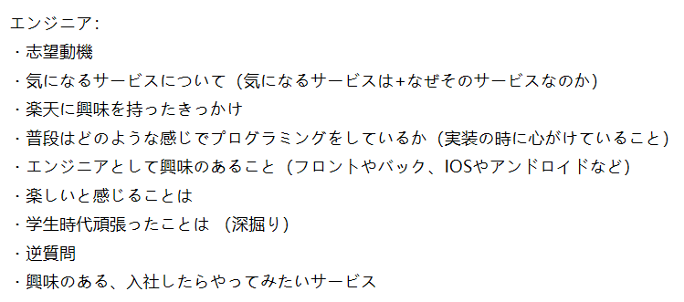
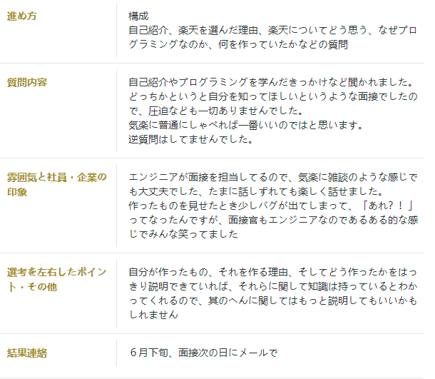

# 1.乐天面试问题：
* `开发的经验`，`成果`，`实习经历`，`团队协作经历:`  
* 遇到最难的问题之类的  ✔
* 团队合作 ✔
* 碰到问题怎么办 
* why rakuten ✔
* 为啥来申application engineer
* 今までどのようなプログラミング開発経験があるか
* コーディングをする時に気をつけていることは何か
* 英語は話せるか
* 楽天のどのサービスに関わりたいか
* 面接では、 どんな部門でどういったサービスの開発を経験してみたいのかや
* 普段プログラミングをどのように学習しているのかという質問があった。
* また、英語で自己紹介を求められたのが印象的でした。
* 自己紹介、
* 楽天を選んだ理由、
* 楽天についてどう思う、
* なぜプログラミングなのか、
* 何を作っていたかなどの質問

可以稍微参考

## 2.逆质问

インターンの期間,部署で使っている言語やフレームワーク 楽天でエンジニアの雰囲気や文化,求められる人材
入职之前可以准备下
最近做的项目

### 乐天调研
`どのサービスに関わりたいのか！！！！`

https://corp.rakuten.co.jp/

https://corp.rakuten.co.jp/investors/documents/results/

# 准备回答集
## 自己紹介

大阪大学情報科学研究科コンピューターサイエンスのチョウジュンジと申します
大学四年参与了小组的web applcation 和 画像处理的研究,现在的研究方向是步容检测.

---
项目碰到问题怎么办
思路 

现象是什么,怎么解决bug的,得到了一个什么结果,你收货了什么. 小而美
用到的框架出了什么样的问题,如何解决的
1.redis查询慢

----

英语能力
研究で英語論文を読んだり

開発する時に〇〇が大変だった」と具体的なことを伝えると面接官の反応は良かったように思えた。

---
楽天のどのサービスに関わりたいか

>関わりたいサービスについては、「楽天市場」を挙げた。その上で、「楽天の中で、最も大きなマネタイズポイントの一つであり、楽天市場のノウハウが楽天グループ全体に波及しており、大きな影響力を持っていると考えているからである。また、市場のシステムを支える有名なエンジニアと働けることは自身の勉強にもなると思う」と回答した。
---

why rakuten 参考

>ものづくりを通して普段の日常生活の中に影響を与えるようなサービスを作りたいと思っていて、良い環境のもとでモノづくりに打ち込める貴社のインターンシップ を志望しました。
日常生活の中には楽天の様々なサービスが根付いていると思います。私自身、普段の生活の中で楽天市場を使ってネットショッピングをしたり、楽天カードを利用したり、NBA RakutenからNBAを視聴していたりと馴染みが深い企業でした。私は大学生からプログラミングというものに触れました。まだまだ技術力に関しては勉強不足な点が多くあると思います。しかし、大学受験で情報科学に進路を選択したのも、「モノづくりを通して普段の日常生活の中に影響を与えるような何かを作ってみたい。」という目標があってのものでした。この目標に至ったきっかけは日常生活の中で私たちは様々な便利なサービスを当然のように使っていて、そうした新たなサービスなどが自分の生活を変える体験を小さい頃からよく感じていました。私はそうした便利だったり、面白い物や今まで誰も考えたことがなかったり、日常生活になくてはならないモノを作りたいと思っています。貴社は自分がずっとやりたいと思っていた“日常生活の中に影響を与えるようなサービス”というものを実現している会社を考えたときに真っ先に頭に浮かんだ企業で、実際に世の中に影響を与えるサービスを数多く生み出している企業だと思いました。しかし、私は現実的にその夢を語る上では、まだそのようなモノがどのようにして作られているかはまだ身近に感じることはできていません。そこで自分のやりたい事を実現させている貴社ではどのような工程でプロダクトを開発しているのか。実際の現場にいるエンジニアはどのようなコミュニケーションをとってチーム開発しているのか。どのような人がどのようなことを考えながら働いているのか。どのような環境で働いているのか。また、貴社に求められる人材とはどのようなレベルなのか。そのうえで今の自分に足りていない点は何か。それを知ってこれからの大学生活の新たな指針にしたいと考えています。以上のような点が貴社のインターンシップ を志望する動機です。
