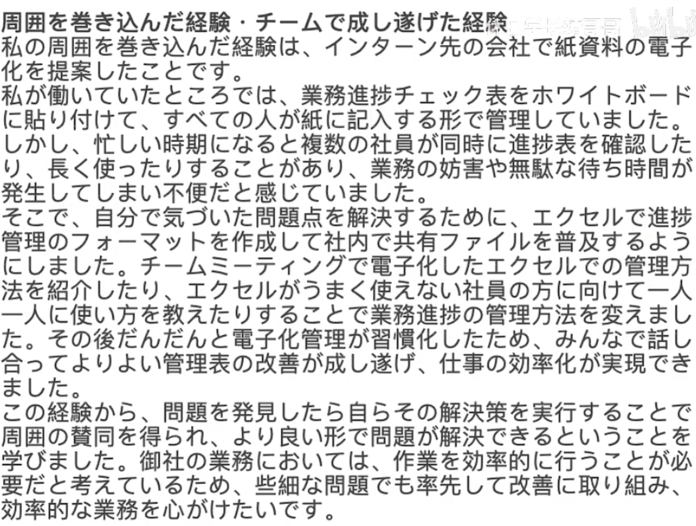

# 经验

当时大家都是直接向组长直接传达想要负责的某个时间段的翻译或校对,但因为不知道其他组员的担当情况,经常会出现多个组员想要翻译同一个片段的情况,组长为此需要进行调整每个人的负责内容,

当時、私たちは直接リーダーに各自が担当したい翻訳や校正の時間帯を伝える形式でしたが、他のメンバーの担当状況を知らなかったため、しばしば複数のメンバーが同じセグメントを翻訳したいという状況が発生しました。そのため、リーダーは各人の担当内容を調整する必要がありました。